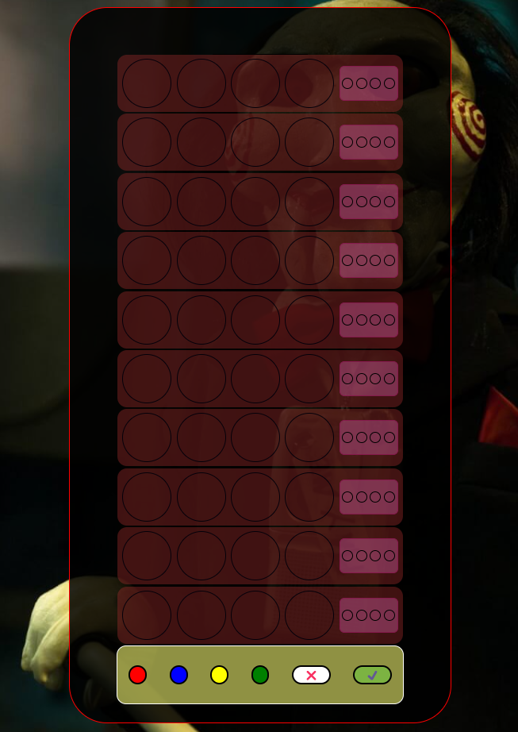

# Proyecto 3 - Mastermind.

Aqui presento el tercer proyecto del bootcamp de Full Stack Developed que ejerce Geekshubs Academy en el cual tenemos que hacer un juego conocido como Mastermind, yo he querido hacerlo con una temática un poco orientada a la película de Saw, se trata de un juego de lógica en el cual tienes que intentar adivinar una combinación ganadora de 4 colores diferentes que eliges antes de empezar a jugar, los cuales después se guardan aleatoriamente pudiendo repetirse algun color en la combinación ganadora.
Una vez en el tablero de juego tienes que ir probando suerte con los colores, a la izquierda aparecerán 4 circulitos con el color base del juego que irán cambiando de color solo si aciertas algun color de la combinación ganadora, si aciertas el color pero no la posición se mostrará la bolita de color blanco, por lo contrario si aciertas el color y la posición se mostrará de color negro, si no aciertas ni posición ni color se quedará del color de fondo.

## Tecnologías utilizadas.

Para este tercer proyecto se nos ha pedido que utilicemos un total de 3 tecnologías diferentes, las cuales aparecen acontinuación:

## Posibles mejoras.

Como posibles mejoras me habria gustado haber tenido un poco mas de tiempo para haber hecho el proyecto un poco mas completo, con algún nivel de dificultad mas, poniendo alguna escena mas de la película entre pantalla y pantalla o haber hecho que en la pantalla de ganador saliera también el nombre del jugador.
También me habria gustado poder haber hecho un tablero un poco de más nivel, algo que con el tiempo deberia corregir.

## Agradecimientos.

Agradezco la ayuda a mis compañeros del bootcamp que siempre que los necesitas están ahí, sobre todo en este proyecto en concreto a Vincenzo, a Pedro y por ultimo sobre todo a Pascual, que me consiguió desbloquear despues de 8 horas de bloqueo y desesperación.